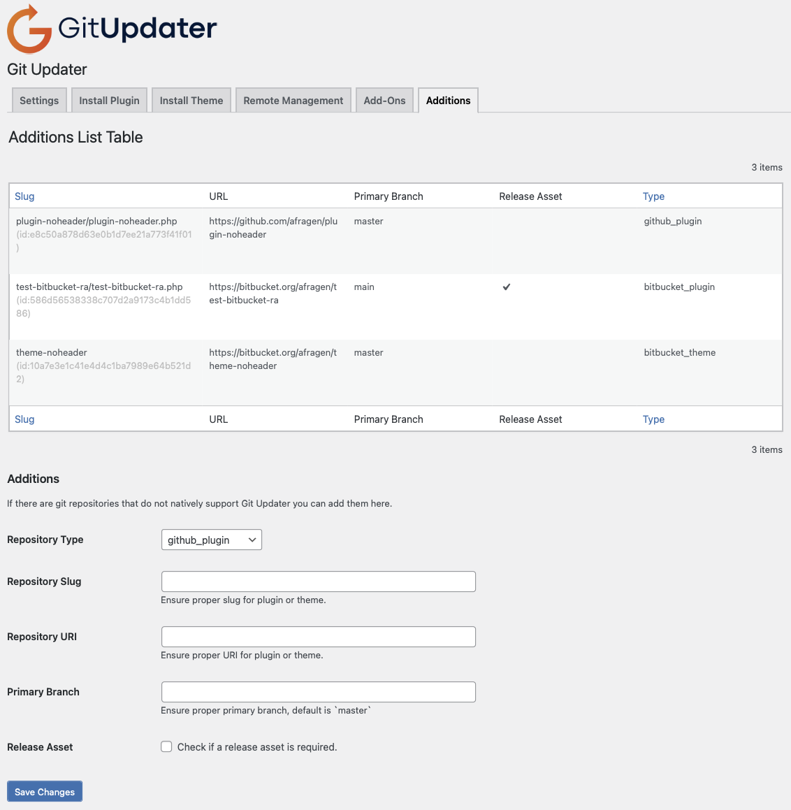

# GitHub Updater Additions
* Contributors: [Andy Fragen](https://github.com/afragen), [contributors](https://github.com/afragen/github-updater-additions/graphs/contributors)
* Tags: plugin, theme, github-updater, extension
* Requires at least: 5.1
* Requires PHP: 5.6
* Stable tag: master
* Donate link: http://thefragens.com/github-updater-donate
* License: MIT

A plugin that allows for adding installed plugins or themes hosted on GitHub, Bitbucket, GitLab, or Gitea that do not contain required headers to GitHub Updater.

## Description

This is a plugin that will add the appropriate data via hooks in GitHub Updater so that repositories that are not correctly configured to use GitHub Updater may be added to GitHub Updater without modifying the repository. This only works for installed plugins/themes.

This plugin adds an **Additions** tab inside the GitHub Updater Settings for updating settings to this plugin.



## Usage

The `"type"` element is from the following list.

* github_plugin
* github_theme
* bitbucket_plugin
* bitbucket_theme
* gitlab_plugin
* gitlab_theme
* gitea_plugin
* gitea_theme

The `"slug"` element is either the plugin slug or the theme stylesheet slug.

The `"uri"` element should be self-explanatory.

### Examples

```
type: github_plugin
slug: plugin-noheader/plugin-noheader.php
uri: https://github.com/afragen/plugin-noheader
```

or

```
type: bitbucket_theme
slug: theme-noheader
uri: https://bitbucket.org/afragen/theme-noheader
```

Above are examples for a plugin or a theme. Please notice the diffence in the `slug`.

## Development
PRs are welcome against the `develop` branch.
